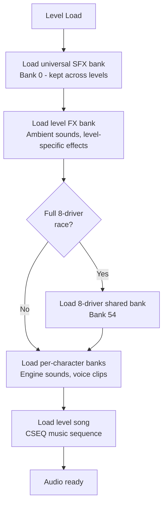
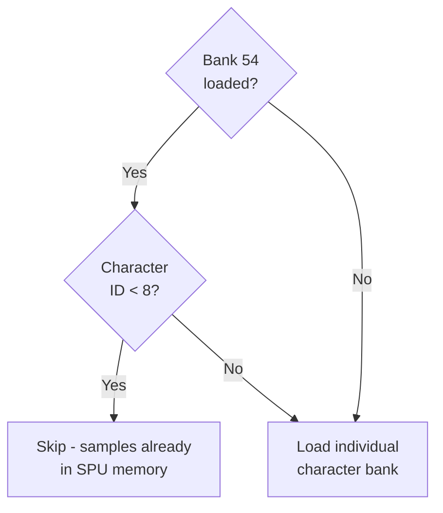
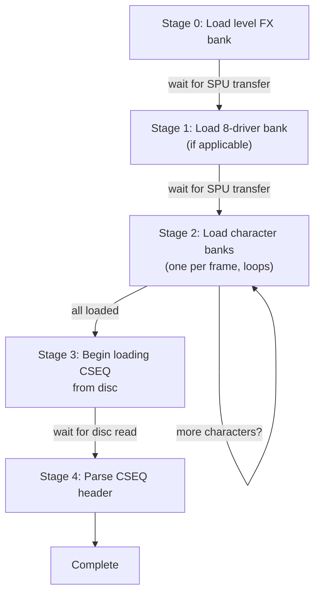
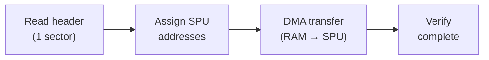

# Audio Loading System

This document describes how CTR selects and loads audio data from the HOWL file at runtime. Audio is loaded in a structured pipeline that selects specific banks and songs based on the current level, game mode, and active characters.

## Overview



The entire pipeline runs asynchronously across multiple frames. Each bank goes through its own sub-pipeline (read from disc, assign SPU addresses, DMA transfer, verify). A maximum of **8 banks** can be resident in SPU memory at any time.

On level transitions, all banks except the universal SFX bank are destroyed and the pipeline restarts.

## Universal SFX Bank

**Bank index: 0**

Bank 0 contains shared sound effects used across all levels (UI sounds, item pickups, generic race sounds, etc.). It is loaded once on the first level load and **kept in SPU memory across level transitions**. All subsequent level loads destroy every other bank but preserve bank 0.

## Level FX Banks

Each drivable track has a dedicated FX bank containing level-specific ambient sounds and effects. The mapping is a simple lookup table indexed by level ID:

| Level ID | Level | FX Bank |
|----------|-------|---------|
| 0 | Dingo Canyon | 1 |
| 1 | Dragon Mines | 2 |
| 2 | Blizzard Bluff | 3 |
| 3 | Crash Cove | 4 |
| 4 | Tiger Temple | 5 |
| 5 | Papu's Pyramid | 6 |
| 6 | Roo's Tubes | 7 |
| 7 | Hot Air Skyway | 8 |
| 8 | Sewer Speedway | 9 |
| 9 | Mystery Caves | 10 |
| 10 | Cortex Castle | 11 |
| 11 | N. Gin Labs | 12 |
| 12 | Polar Pass | 13 |
| 13 | Oxide Station | 14 |
| 14 | Coco Park | 15 |
| 15 | Tiny Arena | 16 |
| 16 | Slide Coliseum | 17 |
| 17 | Turbo Track | 18 |
| 18 | Nitro Court | 19 |
| 19 | Rampage Ruins | 20 |
| 20 | Parking Lot | 21 |
| 21 | Skull Rock | 22 |
| 22 | The North Bowl | 23 |
| 23 | Rocky Road | 24 |
| 24 | Lab Basement | 25 |
| 25-29 | Battle Arenas | 31 |

Special levels use hardcoded FX bank indices:

| Level | FX Bank |
|-------|---------|
| Main Menu | 32 (0x20) |
| Oxide Ending (Any%) | 35 (0x23) |
| Oxide True Ending (100%) | 36 (0x24) |
| Credits | 37 (0x25) |

Boss races override the FX bank with a boss-specific bank (see [Boss Races](#boss-races)).

## Character Banks

Each character has a dedicated audio bank containing their engine sounds and voice clips. The bank index is calculated as:

```
character_bank = 55 + characterID
```

| Character ID | Character | Bank |
|-------------|-----------|------|
| 0 | Crash | 55 |
| 1 | Cortex | 56 |
| 2 | Tiny | 57 |
| 3 | Coco | 58 |
| 4 | N. Gin | 59 |
| 5 | Dingodile | 60 |
| 6 | Polar | 61 |
| 7 | Pura | 62 |

Characters with IDs 8+ (Pinstripe, Papu, Ripper Roo, Komodo Joe, N. Tropy, Penta, Fake Crash, Oxide) follow the same formula but always need their own bank loaded individually.

### 8-Driver Shared Bank

**Bank index: 54**

For races with a full 8-driver grid, bank 54 is loaded as an optimization. This single bank contains the audio samples for all 8 original characters (IDs 0-7), avoiding the need to load 8 individual character banks.



Bank 54 is loaded in:
- **Arcade Mode** races
- **Adventure Mode** races (except boss races, arena battles, crystal challenges, relic races, and the Purple Gem Cup)

Bank 54 is **not** loaded in:
- Boss races
- Adventure arena / battle modes
- Crystal challenges and relic races
- Purple Gem Cup (loads 5 individual character banks instead)
- Adventure hub worlds

### Character Bank Loading Rules

The number and selection of character banks depends on the game mode:

**Standard races (Arcade, Adventure):**
- If bank 54 is loaded: skip original characters, load banks only for non-original characters
- If bank 54 is not loaded: load one bank per active player

**Purple Gem Cup:**
- Loads 5 individual character banks (one per driver in the cup)
- Does not use bank 54

**Adventure Arenas:**
- Loads the player's character bank
- If bank 54 is loaded and the character is original (ID 0-7), skip the character bank
- Additionally loads up to 3 podium reward character banks (for trophy presentation models)

## Song Selection

Each level's music is selected from the HOWL song offset table. Like FX banks, the mapping is a lookup table indexed by level ID:

| Level ID | Level | Song Index |
|----------|-------|------------|
| 0 | Dingo Canyon | 0 |
| 1 | Dragon Mines | 1 |
| 2 | Blizzard Bluff | 2 |
| 3 | Crash Cove | 3 |
| 4 | Tiger Temple | 4 |
| 5 | Papu's Pyramid | 5 |
| 6 | Roo's Tubes | 6 |
| 7 | Hot Air Skyway | 7 |
| 8 | Sewer Speedway | 8 |
| 9 | Mystery Caves | 9 |
| 10 | Cortex Castle | 10 |
| 11 | N. Gin Labs | 11 |
| 12 | Polar Pass | 12 |
| 13 | Oxide Station | 13 |
| 14 | Coco Park | 14 |
| 15 | Tiny Arena | 15 |
| 16 | Slide Coliseum | 16 |
| 17 | Turbo Track | 17 |
| 18 | Nitro Court | 18 |
| 19 | Rampage Ruins | 19 |
| 20 | Parking Lot | 20 |
| 21 | Skull Rock | 21 |
| 22 | The North Bowl | 22 |
| 23 | Rocky Road | 23 |
| 24 | Lab Basement | 24 |
| 25-29 | Battle Arenas | 26 |

Special levels use hardcoded song indices:

| Level | Song Index |
|-------|------------|
| Boss Races (all) | 25 |
| Main Menu / Character Select | 27 |
| Naughty Dog Crate | 28 |
| Intro Race | 29 |
| Oxide Ending (Any%) | 30 |
| Oxide True Ending (100%) | 31 |
| Credits | 32 |

Note: The song index references the HOWL **song offset table**, not the bank offset table. Banks and songs are separate tables in the HOWL header.

## Boss Races

Boss races override both the FX bank and the song. The FX bank is selected from a boss-specific table indexed by boss ID:

| Boss ID | Boss | FX Bank |
|---------|------|---------|
| 0 | Ripper Roo | 26 (0x1A) |
| 1 | Papu Papu | 27 (0x1B) |
| 2 | Komodo Joe | 28 (0x1C) |
| 3 | Pinstripe | 29 (0x1D) |
| 4 | N. Oxide | 30 (0x1E) |
| 5 | N. Oxide (rematch) | 30 (0x1E) |

All boss races use **song index 25** for music, regardless of which track the boss race takes place on.

The 8-driver shared bank (54) is **never** loaded during boss races, so the player's character bank is always loaded individually.

## Special Levels

Two levels bypass the normal async pipeline and load audio synchronously:

| Level | Bank | Song Index | Notes |
|-------|------|------------|-------|
| Intro Race | 34 (0x22) | 29 | Skips directly to song loading (stage 3) |
| Naughty Dog Crate | 33 (0x21) | 28 | Skips directly to song loading (stage 3) |

These levels destroy all banks (including bank 0) and load a single dedicated bank, then jump straight to song loading.

## Loading Pipeline Detail



Stage 2 is the only stage that can loop - it loads one character bank per iteration, incrementing a counter until all required character banks are loaded.

### Bank Sub-Pipeline

Each individual bank load goes through 4 stages:



### Sample Deduplication

When assigning SPU addresses, samples already present in SPU memory (spuAddr != 0) are skipped. This means:
- If bank 0 and a level FX bank share sample IDs, the shared samples are loaded once
- If bank 54 (8-driver) is loaded, individual character banks for original characters can be skipped entirely since all their samples are already in SPU memory
