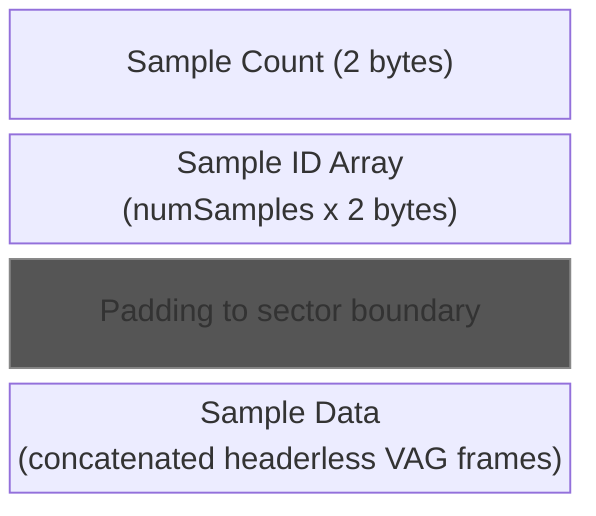
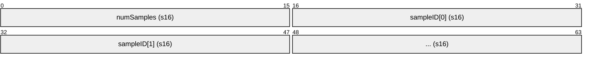
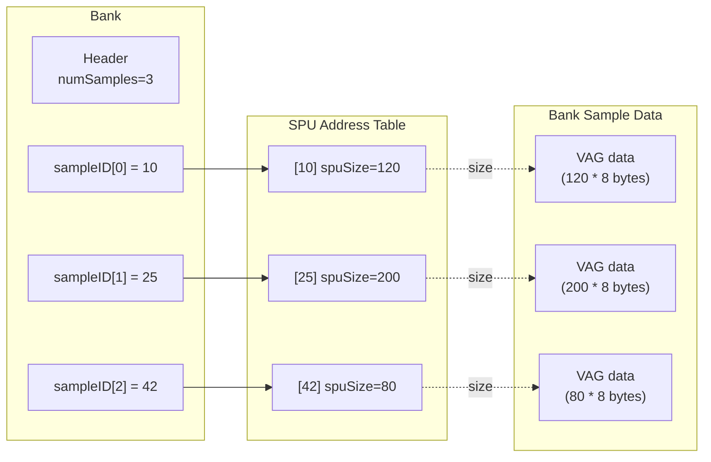
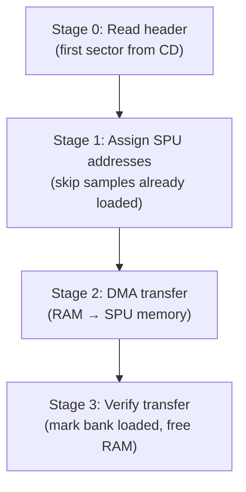

# Bank Format Specification

A bank is a collection of audio samples stored as a sector-aligned blob within the HOWL file. Banks are loaded at runtime to populate SPU RAM with sample data for sound effects and music.

## Bank Layout



## Bank Header



- **numSamples**: Number of samples in this bank (max ~1023)
- **sampleID[i]**: Global SPU Address Table index for sample `i`

## Padding

After the header + sample ID array, the data is padded to the next **sector boundary** (0x800 = 2048 bytes). The sample data begins at this boundary.

```
header_bytes = 2 + numSamples * 2
data_offset = ceil(header_bytes / 2048) * 2048
```

## Sample Data

Starting at the sector boundary, samples are stored **sequentially without gaps**. Each sample's size is determined by the SPU Address Table:

```
sample_byte_size = spu_addrs[sampleID].spuSize * 8
```

The sample data is raw VAG ADPCM frames (headerless). See [vag.md](vag.md) for the frame encoding.

## How Banks Reference Samples



## Runtime Loading

The game loads banks through a 4-stage asynchronous pipeline:



### Stage 0: Load Header
- Read the first sector of the bank from CD into RAM
- This contains the sample count and ID array

### Stage 1: Calculate Sizes and Assign SPU Addresses
- Sum all `spuSize` values for samples in the bank (multiplied by 8 for byte count)
- For each sample where `spuAddr == 0` (not yet loaded), assign a new SPU address from the allocation pointer
- Track the address range (min/max) for this bank

### Stage 2: DMA Transfer
- Transfer sample data from RAM to SPU memory via DMA

### Stage 3: Verify Transfer
- Wait for SPU transfer completion
- Mark bank as loaded
- Free temporary RAM allocation

## Bank Destruction

When SPU memory needs to be reclaimed, the game scans the SPU Address Table and resets any entry with `spuAddr` within the target range back to 0. This allows the SPU memory region to be reused by future bank loads.

## Sample Deduplication

Multiple banks can reference the same sample ID. When loading a bank, if a sample's `spuAddr` is already non-zero (loaded by a previous bank), the SPU address is preserved and the data is not re-transferred. This saves SPU memory when banks share samples (e.g., the common SFX bank shares samples with level-specific banks).

## Example

For a bank with 3 samples referencing SPU IDs [10, 25, 42]:

```
Offset 0x000: 03 00           numSamples = 3
Offset 0x002: 0A 00           sampleID[0] = 10
Offset 0x004: 19 00           sampleID[1] = 25
Offset 0x006: 2A 00           sampleID[2] = 42
Offset 0x008-0x7FF: 00...     padding to sector boundary
Offset 0x800: [VAG data]      sample 10 data (size = spu_addrs[10].spuSize * 8)
              [VAG data]      sample 25 data (size = spu_addrs[25].spuSize * 8)
              [VAG data]      sample 42 data (size = spu_addrs[42].spuSize * 8)
```
