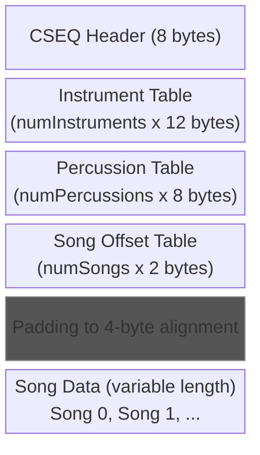
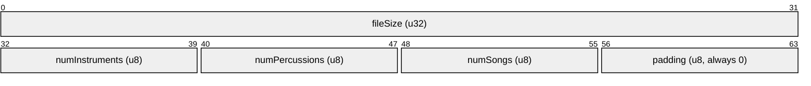
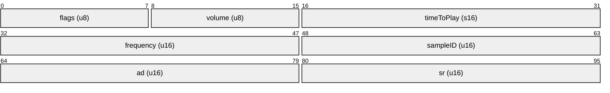
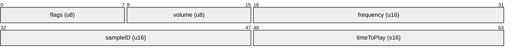
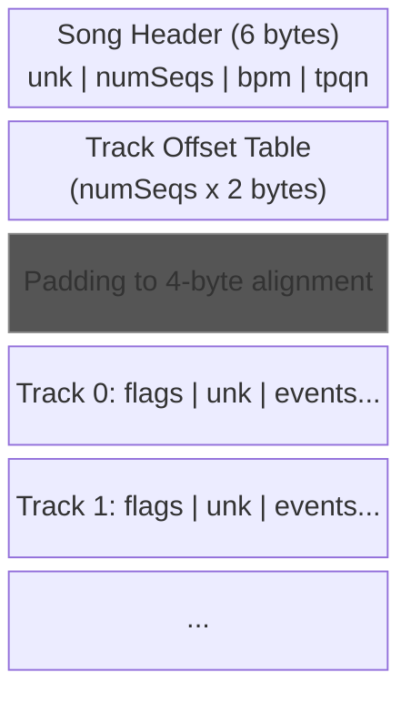
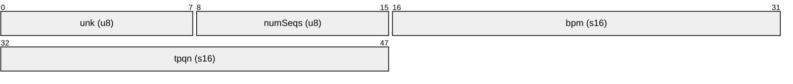
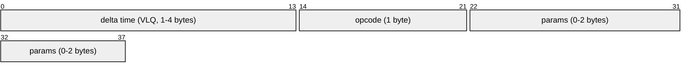

# CSEQ Sequence Format Specification

CSEQ is CTR's music sequence format, similar to MIDI. Each CSEQ blob (stored as a "song" in the HOWL file) contains instrument definitions, percussion definitions, and one or more playable sequences with tracks of timed note/control events.

## Table of Contents

- [File Layout](#file-layout)
- [CSEQ Header (8 bytes)](#cseq-header-8-bytes)
- [Instrument Table (Long Samples)](#instrument-table-long-samples)
  - [Instrument Volume Calculation (Runtime)](#instrument-volume-calculation-runtime)
- [Percussion Table (Short Samples)](#percussion-table-short-samples)
- [Song Offset Table](#song-offset-table)
- [Song Data](#song-data)
  - [Song Header (6 bytes)](#song-header-6-bytes)
  - [Track Structure](#track-structure)
- [Event Format](#event-format)
  - [Opcodes](#opcodes)
  - [NoteOn (0x05)](#noteon-0x05)
  - [ChangePatch (0x09)](#changepatch-0x09)
- [Variable-Length Quantity (VLQ)](#variable-length-quantity-vlq)
  - [Examples](#examples)
  - [Decoding Algorithm](#decoding-algorithm)
- [Pitch and Frequency](#pitch-and-frequency)

## File Layout



## CSEQ Header (8 bytes)



Note: `numSongs` and `padding` occupy the same 2 bytes that could be read as a single `u16`. Both interpretations produce the same result since `padding` is always 0.

## Instrument Table (Long Samples)

Each instrument entry is 12 bytes. These define melodic instruments used by tracks.



| Field      | Description                                                           |
|------------|-----------------------------------------------------------------------|
| flags      | Always 1 in original data. 1=music sample, 2=looped, 4=voice clip    |
| volume     | Sample volume (0-255)                                                 |
| timeToPlay | Delay before NoteOff. 0 for music, ~300 for ~1 sec                   |
| frequency  | Base pitch. 4096 = 44100 Hz (see [howl.md](howl.md#frequency-encoding)) |
| sampleID   | Index into HOWL SPU Address Table                                     |
| ad         | PSX SPU ADSR Attack/Decay register value                              |
| sr         | PSX SPU ADSR Sustain/Release register value                           |

Common ADSR values: `ad = 0x80FF`, `sr = 0x1FC2`. These can be stored as a single 32-bit value: `adsr = (sr << 16) | ad`.

### Instrument Volume Calculation (Runtime)

```
final_volume = (masterVolMusic * songVol * seqVol * instrument.volume) >> 10
```

## Percussion Table (Short Samples)

Each percussion entry is 8 bytes. These define drum/percussion instruments.



Note: Percussion uses **fixed ADSR** values (`ad = 0x80FF`, `sr = 0x1FC2`) that are not stored in the file.

Note: The field order differs from instruments. In instruments, `timeToPlay` is at offset 0x02 and `sampleID` at 0x06. In percussion, `sampleID` is at offset 0x04 and `timeToPlay` at 0x06.

## Song Offset Table

`numSongs` entries, each a little-endian **signed 16-bit** offset. These are byte offsets relative to the start of the song data section (after alignment padding).

## Song Data

### Song Structure



### Song Header (6 bytes)



### Track Structure

Each track starts with a 2-byte header:


- **flags** bit 0: 1 = percussion/drum track, 0 = melodic track
- **unk**: Unknown parameter (copied to sequence state at runtime)

Followed by a variable-length sequence of events.

## Event Format

Each event consists of:



### Opcodes

| Value | Name         | Params | Description                              |
|-------|--------------|--------|------------------------------------------|
| 0x00  | Terminator   | 0      | End of event data (terminal)             |
| 0x01  | NoteOff      | 1      | Stop note. Param: pitch/drum index       |
| 0x02  | EndTrack2    | 1      | Alternate end track (terminal)           |
| 0x03  | EndTrack     | 0      | End of track (terminal)                  |
| 0x04  | Unknown4     | 1      | Unknown control event                    |
| 0x05  | NoteOn       | 2      | Start note. Params: pitch, velocity      |
| 0x06  | Velocity     | 1      | Set track volume. Param: velocity        |
| 0x07  | Pan          | 1      | Set stereo pan. Param: pan (0x80=center) |
| 0x08  | Unknown8     | 1      | Unknown control (reverb-related?)        |
| 0x09  | ChangePatch  | 1      | Select instrument. Param: instrument ID  |
| 0x0A  | PitchBend    | 1      | Bend pitch. Param: bend amount           |

Terminal events (Terminator, EndTrack, EndTrack2) signal the end of event data for a track.

### NoteOn (0x05)

Parameters:
- Byte 1: Pitch index (for melodic) or drum index (for percussion)
- Byte 2: Velocity (volume, 0-255)

For melodic tracks, the pitch is used to look up a frequency from a note table. For drum tracks, the pitch is a direct index into the percussion table.

### ChangePatch (0x09)

Sets the current instrument for subsequent NoteOn events. The parameter is an index into either the instrument table (melodic tracks) or percussion table (drum tracks).

## Variable-Length Quantity (VLQ)

Delta times use MIDI-style variable-length encoding:

- Each byte contributes 7 data bits (bits 6:0)
- Bit 7 (MSB) is a continuation flag: 1 = more bytes follow, 0 = final byte
- Bytes are in big-endian bit order

### Examples

| Bytes          | Value  |
|----------------|--------|
| `0x00`         | 0      |
| `0x7F`         | 127    |
| `0x81 0x00`    | 128    |
| `0x81 0x48`    | 200    |
| `0xFF 0x7F`    | 16383  |

### Decoding Algorithm

```
result = 0
loop:
    byte = read_next_byte()
    result = (result << 7) | (byte & 0x7F)
    if (byte & 0x80) == 0:
        return result
```

## Pitch and Frequency

Instrument frequencies use the encoding: `4096 = 44100 Hz`

```
frequency_hz = (internal_value / 4096) * 44100
internal_value = (frequency_hz * 4096) / 44100
```

At runtime, note pitch modifies the base frequency using a lookup table indexed by note number and octave, with optional distortion modifiers.
