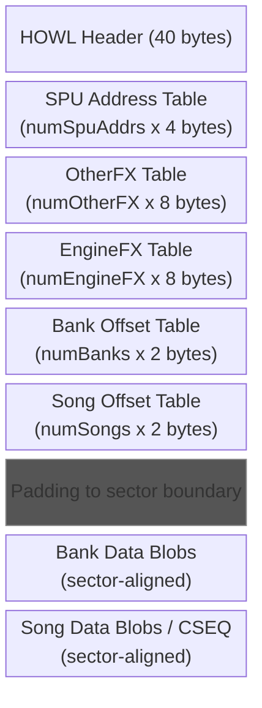
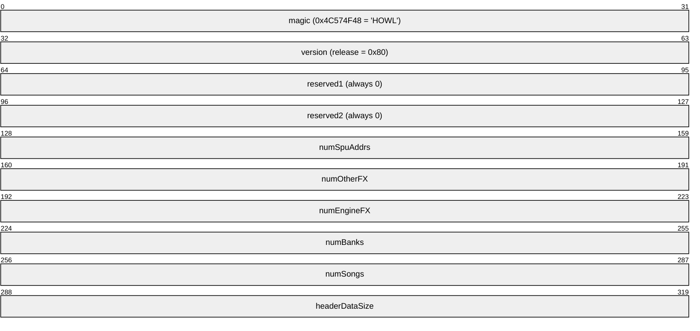
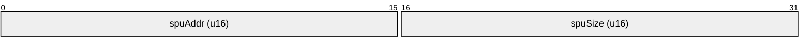
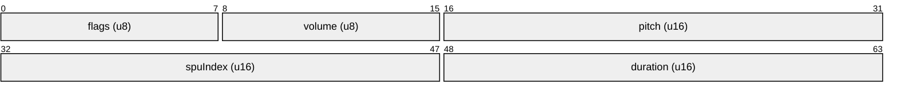
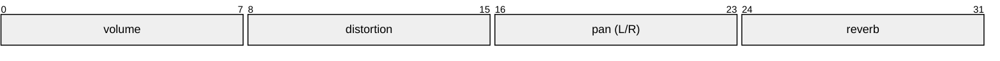
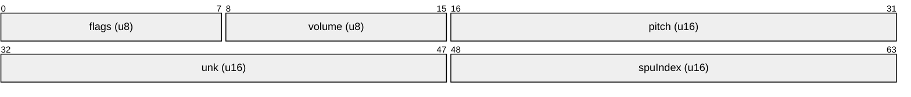
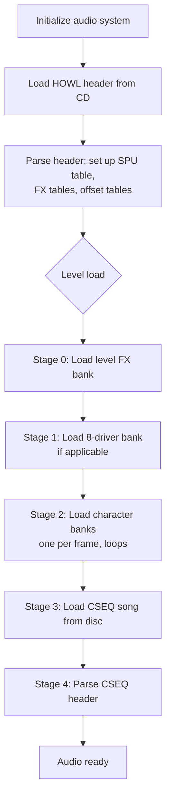

# HOWL (.HWL) File Format Specification

The HOWL file is the master audio container used by Crash Team Racing (PS1). It bundles all audio data for the game: SPU sample metadata, sound effect definitions, engine sound definitions, sample banks, and music sequences.

## Table of Contents

- [File Layout](#file-layout)
- [HOWL Header (40 bytes)](#howl-header-40-bytes)
  - [Known Versions](#known-versions)
- [SPU Address Table](#spu-address-table)
  - [SPU Memory at Runtime](#spu-memory-at-runtime)
- [OtherFX Table (Sound Effects)](#otherfx-table-sound-effects)
  - [Playback Parameters](#playback-parameters)
- [EngineFX Table (Engine Sounds)](#enginefx-table-engine-sounds)
- [Bank Offset Table](#bank-offset-table)
- [Song Offset Table](#song-offset-table)
- [Bank Data](#bank-data)
- [KART.HWL Statistics (NTSC-U Release)](#karthwl-statistics-ntsc-u-release)
  - [Bank Names (NTSC-U)](#bank-names-ntsc-u)
- [Loading Sequence (Runtime)](#loading-sequence-runtime)
- [Channel Types](#channel-types)
- [Frequency Encoding](#frequency-encoding)

The file used in-game is `SOUNDS\KART.HWL`.

## File Layout



All data blobs are aligned to **sector boundaries** (0x800 = 2048 bytes).

## HOWL Header (40 bytes)

10 little-endian 32-bit integers:



The `headerDataSize` field equals:
```
numSpuAddrs * 4 + numOtherFX * 8 + numEngineFX * 8 + numBanks * 2 + numSongs * 2
```

### Known Versions

| Value | Build                |
|-------|----------------------|
| 0x6F  | Demo (Test Drive)    |
| 0x71  | Demo (OPSM)         |
| 0x72  | Demo (Spyro)        |
| 0x78  | Beta (Aug 5)         |
| 0x7D  | Prototype            |
| 0x80  | Release (all regions)|

## SPU Address Table

Immediately follows the header. Each entry is 4 bytes:



- **spuAddr**: SPU RAM address in 8-byte units. Always 0 in the file; populated at runtime when the bank is loaded.
- **spuSize**: Sample data size in 8-byte units. Multiply by 8 for byte count.

The table index serves as the **global sample ID** referenced by banks, instruments, and sound effects.

### SPU Memory at Runtime

- Total SPU RAM: 512 KB (`0x7E000` bytes)
- Addresses stored as 8-byte units: `actual_byte_address = spuAddr * 8`
- `spuAddr == 0` means the sample is not currently loaded in SPU memory
- The game dynamically loads/unloads banks to manage SPU memory

## OtherFX Table (Sound Effects)

Sound effects triggered during gameplay (pickups, crashes, menu sounds, voice clips, etc.). Each entry is 8 bytes:



| Field    | Description                                |
|----------|--------------------------------------------|
| flags    | Bit 2: voice clip, Bit 1: looping          |
| volume   | Base volume (0-255)                        |
| pitch    | Base pitch value                           |
| spuIndex | Index into SPU Address Table (sample ID)   |
| duration | Sound duration in game frames              |

### Playback Parameters

When a sound effect is triggered, the caller passes a flags word:



- **distortion**: 0x80 = none
- **pan**: 0x80 = center

Volume calculation: `(masterVolFX * entry.volume * callVolume) >> 10`

ADSR is fixed at: Attack/Decay = `0x80FF`, Sustain/Release = `0x1FC2`

## EngineFX Table (Engine Sounds)

Vehicle engine audio. Each entry is 8 bytes:



Note: The field order differs from OtherFX. In OtherFX, `spuIndex` is at offset 0x04 and `duration` at 0x06. In EngineFX, `unk` is at 0x04 and `spuIndex` at 0x06.

Engine pitch is dynamically modulated at runtime based on vehicle acceleration/RPM.

## Bank Offset Table

`numBanks` entries, each a little-endian **unsigned 16-bit** sector offset:

```
bank_byte_offset = bank_sector_offset * 0x800
```

The offset is relative to the start of the HOWL file. A value of 0 indicates an empty/unused bank slot.

## Song Offset Table

`numSongs` entries, each a little-endian **unsigned 16-bit** sector offset:

```
song_byte_offset = song_sector_offset * 0x800
```

Song data at the referenced offset contains a CSEQ sequence. See [cseq.md](cseq.md).

## Bank Data

Each bank blob starts at a sector boundary. See [bank.md](bank.md).

## KART.HWL Statistics (NTSC-U Release)

| Field           | Value |
|-----------------|-------|
| Version         | 0x80  |
| SPU Entries     | 528   |
| OtherFX Entries | 258   |
| EngineFX Entries| 20    |
| Banks           | 71    |
| Songs           | 33    |
| Header Size     | 4544  |
| File Size       | ~11.7 MB |

### Bank Names (NTSC-U)

| Index | Name             | Index | Name              |
|-------|------------------|-------|-------------------|
| 0     | sfx              | 18    | nitro_court       |
| 1     | canyon           | 19    | rampage_ruins     |
| 2     | mines            | 20    | parking_lot       |
| 3     | bluff            | 21    | skull_rock        |
| 4     | cove             | 22    | north_bowl        |
| 5     | temple           | 23    | rocky_road        |
| 6     | pyramid          | 24    | lab_basement      |
| 7     | tubes            | 25    | boss_challenge    |
| 8     | skyway           | 26    | adv_gem_valley    |
| 9     | sewer            | 27    | character_select  |
| 10    | caves            | 28    | intro             |
| 11    | castle           | 29    | cutscenes         |
| 12    | labs             | 30    | cutscenes_oxide1  |
| 13    | pass             | 31    | cutscenes_oxide2  |
| 14    | station          | 32    | credits           |
| 15    | park             | ...   | (per-character)   |
| 16    | arena            |       |                   |
| 17    | coliseum/turbo   |       |                   |

## Loading Sequence (Runtime)



## Channel Types

The game uses 3 channel types for audio playback:

| Type | Value | Description                                    |
|------|-------|------------------------------------------------|
| Engine | 0   | Engine sounds (continuous, pitch-modulated)    |
| Other  | 1   | Sound effects (timed duration)                 |
| Music  | 2   | CSEQ music notes (sequenced)                  |

## Frequency Encoding

Internal frequency values use 4096 as a base corresponding to 44100 Hz:

```
frequency_hz = (internal_value / 4096) * 44100
internal_value = (frequency_hz * 4096) / 44100
```

| Internal | Hz     |
|----------|--------|
| 4096     | 44100  |
| 2048     | 22050  |
| 1024     | 11025  |
