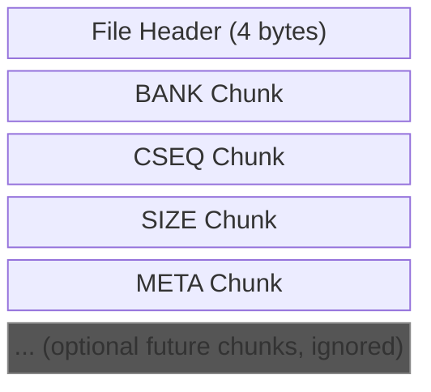
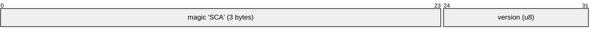
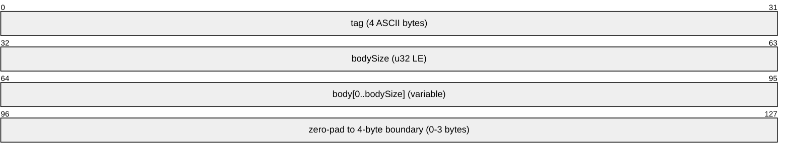

# Saphi Audio Container (.sca) Format Specification

The Saphi Audio Container (`.sca`) bundles one bank + one CSEQ + per-sample SPU sizes + metadata into a single file. It is the artifact the Saphi runtime streams into PS1 memory at level-load time to override a track's music without modifying KART.HWL on disc.

## Table of Contents

- [File Layout](#file-layout)
- [File Header](#file-header)
- [Chunk Structure](#chunk-structure)
- [Chunk Types](#chunk-types)
  - [BANK Chunk](#bank-chunk)
  - [CSEQ Chunk](#cseq-chunk)
  - [SIZE Chunk](#size-chunk)
  - [META Chunk](#meta-chunk)
- [Required Chunks and Ordering](#required-chunks-and-ordering)
- [Forward Compatibility](#forward-compatibility)
- [Runtime Consumption](#runtime-consumption)
- [Size Limits](#size-limits)
- [Example](#example)

## File Layout



The file is a 4-byte header followed by a flat sequence of TLV chunks. There is no chunk count in the header — readers walk chunks until end-of-file.

## File Header



- **magic**: ASCII `S`, `C`, `A` (0x53 0x43 0x41). Files that do not start with these three bytes should be rejected.
- **version**: Format version. Currently `1`. Readers should reject unknown versions.

## Chunk Structure

Each chunk is a self-describing TLV block:



- **tag**: 4 ASCII bytes identifying the chunk type. Tags are case-sensitive.
- **bodySize**: Length of the body in bytes, little-endian. Zero is valid.
- **body**: `bodySize` raw bytes. Content depends on the tag.
- **pad**: Zero-padding such that the next chunk's tag begins on a 4-byte boundary. Equal to `(-bodySize) & 3` bytes. The pad bytes are not counted in `bodySize`.

## Chunk Types

### BANK Chunk

- **tag**: `BANK` (`0x42 0x41 0x4E 0x4B`)
- **body**: The raw bank blob, byte-identical to what `.bnk` export produces. This includes the bank header (sample count + sample ID array), sector-padding to `0x800`, and the concatenated VAG sample data. See [bank.md](bank.md) for the bank layout.

**Purpose**: The Saphi runtime DMAs the sample data (starting at body offset `0x800`) into SPU RAM and patches the SPU Address Table so the bank's sample IDs point at the freshly-DMA'd region.

### CSEQ Chunk

- **tag**: `CSEQ` (`0x43 0x53 0x45 0x51`)
- **body**: The raw CSEQ blob, byte-identical to what `.cseq` export produces. See [cseq.md](cseq.md) for the CSEQ layout.

**Purpose**: The Saphi runtime points the game's `ptrCseqHeader` chain at this body so playback opcodes resolve against the imported song instead of the stock one.

### SIZE Chunk

- **tag**: `SIZE` (`0x53 0x49 0x5A 0x45`)
- **body**: A packed array of little-endian `u16` values. The count is `bodySize / 2`, which must equal the bank's `numSamples`.
- **value units**: Each entry is one sample's `spuSize` in 8-byte units (the same encoding the SPU Address Table uses). Multiply by 8 for byte count.
- **ordering**: Bank-header order. Entry `i` is the size of the sample whose ID is at bank position `i`.

**Purpose**: The creator's source HWL may have different `spuSize` values for shared sample IDs than the player's ISO HOWL (for example, a remixed sample is larger). The Saphi runtime applies these sizes as overrides so the in-game SPU layout matches the bank blob's actual sample sizes, not the ISO's.

### META Chunk

- **tag**: `META` (`0x4D 0x45 0x54 0x41`)
- **body**: A UTF-8 encoded JSON object. The body is **not** null-terminated.
- **required keys**: `name` (string), `author` (string). Decoders should reject objects missing either key.
- **extra keys**: Decoders should accept and ignore additional keys for forward compatibility.

Example body (44 bytes):

```json
{"name": "Breeze Harbor", "author": "Boxic"}
```

## Required Chunks and Ordering

Every well-formed `.sca` file must contain exactly one each of `BANK`, `CSEQ`, `SIZE`, `META`. Readers should report a clear error if any required chunk is absent.

The current writer emits them in the order `BANK → CSEQ → SIZE → META`, but readers should not depend on order — they are matched by tag.

## Forward Compatibility

Readers should skip chunks whose tag is not recognized. This lets future format revisions add optional chunks (e.g., a `ART ` thumbnail, `LOOP` markers, `INFO` BPM data) without breaking older readers — they just won't surface the new data.

The reverse is not guaranteed: a v2 reader is free to require chunks that v1 files don't contain. Bumping the version field signals such breakage.

## Runtime Consumption

The Saphi PS1 mod treats the `.sca` body as an opaque source for three things:

1. The bank's sample data is DMA-streamed into SPU RAM at a runtime-chosen address.
2. The Bank's sample IDs are used to patch the SPU Address Table — each ID's `spuAddr` is set to the DMA'd position, and each ID's `spuSize` is overridden with the matching `SIZE` chunk entry.
3. The CSEQ body is wired into the game's music engine via `howl_ParseCseqHeader`, which fills the `ptrCseqHeader / ptrCseqLongSamples / ptrCseqShortSamples / ptrCseqSongStartOffset / ptrCseqSongData` pointer chain.

## Size Limits

The Saphi runtime reserves a fixed memory region for the container:

| Chunk | Maximum body size                                                                   |
|-------|-------------------------------------------------------------------------------------|
| BANK  | `0x57800` (350 KB)                                                                  |
| CSEQ  | `0xC000`  (48 KB)                                                                   |
| SIZE  | `256 entries` (512 bytes) — one per sample, capped by the maximum bank sample count |
| META  | Unconstrained in the format; in practice fits comfortably under 1 KB                |

Files exceeding any of these caps are rejected at upload time.

## Example

A minimal valid file with 2 bank samples, a 4-byte CSEQ, and short metadata:

```
File Header (4 bytes):
  Offset 0x000: 53 43 41                magic = "SCA"
  Offset 0x003: 01                      version = 1

BANK chunk:
  Offset 0x004: 42 41 4E 4B             tag = "BANK"
  Offset 0x008: 04 08 00 00             bodySize = 0x0804
  Offset 0x00C: [bank blob, 0x0804 B]   body
  (no padding — bodySize is already 4-byte aligned)

CSEQ chunk:
  Offset 0x810: 43 53 45 51             tag = "CSEQ"
  Offset 0x814: 04 00 00 00             bodySize = 4
  Offset 0x818: 12 34 56 78             body
  (no padding)

SIZE chunk:
  Offset 0x81C: 53 49 5A 45             tag = "SIZE"
  Offset 0x820: 04 00 00 00             bodySize = 4 (2 entries)
  Offset 0x824: 64 00 C8 00             body = [100, 200] (LE u16)

META chunk:
  Offset 0x828: 4D 45 54 41             tag = "META"
  Offset 0x82C: 24 00 00 00             bodySize = 36
  Offset 0x830: {"name":"Track","author":"Author"}
  (no padding — 36 % 4 == 0; end of file at 0x854)
```
