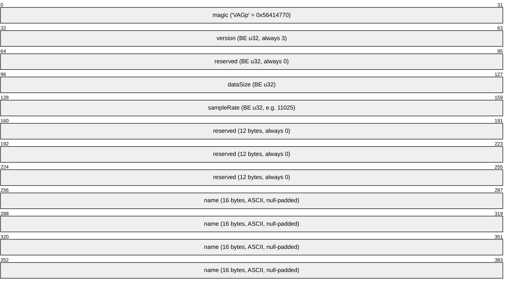
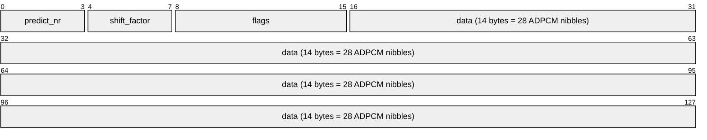

# VAG (PlayStation ADPCM) Format Specification

VAG is the standard audio sample format for the PlayStation 1. It stores audio compressed using ADPCM (Adaptive Differential Pulse-Code Modulation) at a 4:1 compression ratio.

## Table of Contents

- [Standalone VAG File](#standalone-vag-file)
  - [VAG Header (48 bytes)](#vag-header-48-bytes)
- [In-Bank VAG Data](#in-bank-vag-data)
- [ADPCM Frame Structure](#adpcm-frame-structure)
  - [Frame Flags](#frame-flags)
  - [ADPCM Prediction Coefficients](#adpcm-prediction-coefficients)
  - [Decoding Algorithm](#decoding-algorithm)
- [SPU Address Table Relationship](#spu-address-table-relationship)
- [Common Sample Rates](#common-sample-rates)

## Standalone VAG File

When stored as a standalone `.vag` file, a 48-byte header precedes the sample data.

### VAG Header (48 bytes)

All header fields are **big-endian** (unlike most PS1 data which is little-endian).



Sample data starts at offset 0x30 (48 bytes).

## In-Bank VAG Data

When stored inside a HOWL bank, VAG data has **no header**. It is raw ADPCM frame data. The sample rate and size are determined from the CSEQ instrument definition and SPU Address Table respectively.

## ADPCM Frame Structure

Each VAG frame is **16 bytes** and decodes to **28 audio samples** (56 bytes of 16-bit PCM).



- **predict_nr** (upper 4 bits of byte 0): Selects filter coefficient pair (0-4)
- **shift_factor** (lower 4 bits of byte 0): Bit shift for decompression (0-15)
- **flags** (byte 1): Frame control flags
- **data** (bytes 2-15): 28 ADPCM nibbles, 2 per byte, low nibble first

### Frame Flags

| Value | Meaning                                   |
|-------|-------------------------------------------|
| 0     | Normal frame                              |
| 2     | Loop end point                            |
| 3     | Loop end + loop marker                    |
| 6     | Loop start marker                         |
| 7     | End of sample (last frame)                |

### ADPCM Prediction Coefficients

The `predict_nr` selects a pair of filter coefficients:

| predict_nr | f0       | f1       |
|------------|----------|----------|
| 0          | 0.0      | 0.0      |
| 1          | 60/64    | 0.0      |
| 2          | 115/64   | -52/64   |
| 3          | 98/64    | -55/64   |
| 4          | 122/64   | -60/64   |

### Decoding Algorithm

For each nibble in the data:

```
sample = sign_extend_4bit(nibble) << (12 - shift_factor)
sample += (prev1 * f0 + prev2 * f1) / 64
output = clamp(sample, -32768, 32767)
prev2 = prev1
prev1 = output
```

## SPU Address Table Relationship

In the HOWL file, the SPU Address Table maps global sample IDs to sizes:

```
actual_byte_size = spu_addrs[sampleID].spuSize * 8
num_frames = actual_byte_size / 16
num_pcm_samples = num_frames * 28
```

## Common Sample Rates

| Rate   | Usage                                    |
|--------|------------------------------------------|
| 11025  | Most CTR sound effects and music samples |
| 22050  | Higher quality effects                   |
| 44100  | Rare, highest quality                    |
